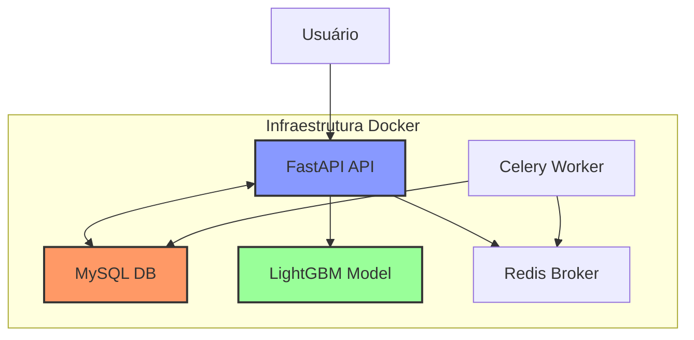
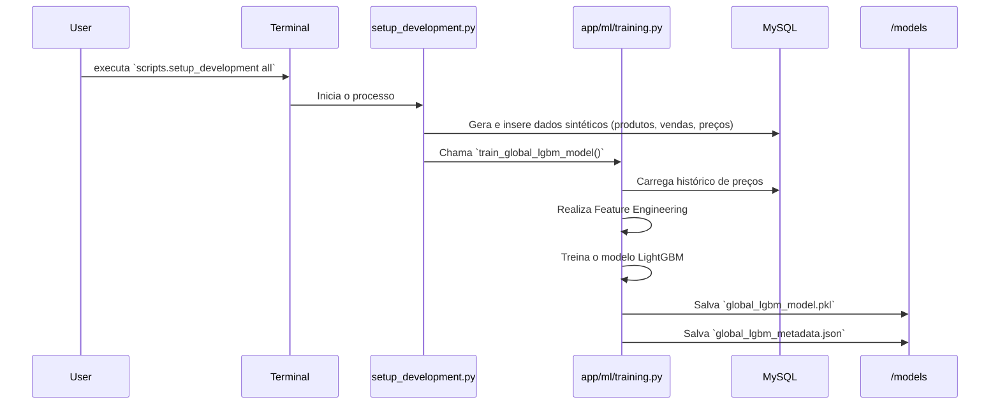
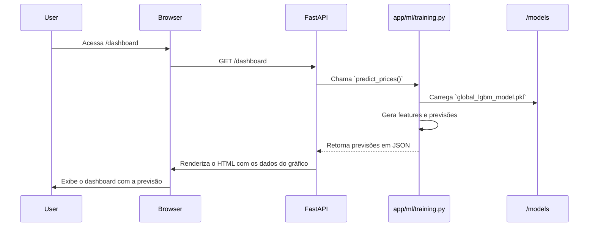

# Estrutura e Roadmap do Projeto de Automação de Compras

Este documento detalha a arquitetura técnica, a estrutura de diretórios, o fluxo de dados e o roadmap de futuras implementações para o sistema de automação inteligente de ordens de compra.

---

## 1. Arquitetura e Estrutura de Diretórios

O projeto é organizado em uma estrutura de microsserviços containerizada, visando a separação de responsabilidades e a escalabilidade.

### Estrutura de Pastas

```
. (Raiz do Projeto)
├── app/                    # Código fonte da aplicação principal (FastAPI)
│   ├── core/               # Lógica central (config, DB, Celery)
│   ├── ml/                 # Módulos de Machine Learning (treino, previsão)
│   ├── models/             # Modelos de dados (SQLModel)
│   └── routers/            # Endpoints da API (rotas)
├── data/                   # Dados brutos ou auxiliares (vazio por padrão)
├── models/                 # Modelos de ML treinados (.pkl) e metadados (.json)
├── scripts/                # Scripts de utilidade (setup, treino, etc.)
├── .env                    # Arquivo de variáveis de ambiente (local)
├── docker-compose.yml      # Orquestração dos serviços Docker
├── Dockerfile              # Definição do contêiner da aplicação
└── README.md               # Documentação principal do projeto
```

### Visão Geral dos Serviços



- **`app/`**: Contém toda a lógica da aplicação Python. É o coração do serviço `api` e `worker`.
- **`models/`**: Diretório persistido que armazena os artefatos do modelo de ML. Essencial para que o estado do treinamento não se perca.
- **`scripts/`**: Scripts executados manualmente para tarefas de desenvolvimento e manutenção, como o `setup_development.py`.

---

## 2. Fluxo de Dados End-to-End

O sistema opera em dois fluxos principais: **Treinamento do Modelo** e **Geração de Previsão**.

### Fluxo de Treinamento

Este fluxo é executado para criar e salvar o modelo de previsão.



### Fluxo de Previsão (Dashboard)

Este fluxo ocorre toda vez que um usuário acessa o dashboard.



---

## 3. Roadmap de Futuras Atualizações

O projeto atual é uma base sólida. As próximas etapas podem focar em transformar as previsões em ações concretas e em tornar o sistema mais robusto e automatizado.

### Curto Prazo

1.  **Endpoint de Recomendação de Compra**:

    - **O que**: Criar um novo endpoint (`/api/recommendations`) que, para cada produto, utiliza a previsão de preços para sugerir o **melhor dia para realizar a compra** (o dia com o menor preço previsto no horizonte de 14 dias).
    - **Por que**: Transforma a previsão em uma recomendação acionável, que é o objetivo final do projeto.

2.  **Implementar Tarefas com Celery**:
    - **O que**: Criar uma tarefa assíncrona no Celery para o retreinamento do modelo. A tarefa poderia ser disparada via um endpoint na API.
    - **Por que**: Desacopla tarefas pesadas (como o treinamento) da API principal, evitando que ela fique sobrecarregada.

### Médio Prazo

3.  **Retreinamento Automático (Celery Beat)**:

    - **O que**: Usar o serviço `beat` para agendar a tarefa de retreinamento para ser executada automaticamente em intervalos regulares (ex: semanalmente).
    - **Por que**: Garante que o modelo esteja sempre atualizado com os dados mais recentes, sem intervenção manual.

4.  **Autenticação e Multi-Tenancy**:
    - **O que**: Adicionar um sistema de login para proteger o acesso ao dashboard e aos dados. Evoluir para um sistema _multi-tenant_, onde diferentes empresas possam gerenciar seus próprios catálogos de produtos.
    - **Por que**: Prepara o sistema para um ambiente de produção real e multi-usuário.

### Longo Prazo

5.  **Ingestão de Dados Reais**:

    - **O que**: Substituir o gerador de dados sintéticos por um pipeline de ingestão de dados reais, seja através de web scraping de sites de e-commerce ou integração com APIs de fornecedores.
    - **Por que**: Aumenta a precisão e a relevância do modelo ao usar dados do mundo real.

6.  **Monitoramento e Observabilidade**:
    - **O que**: Integrar ferramentas como **Prometheus** e **Grafana** para monitorar a saúde dos serviços, a performance da API e as métricas do modelo de ML (ex: _data drift_, _concept drift_).
    - **Por que**: Essencial para manter a confiabilidade e a performance do sistema em produção.

## 4. Arquitetura do Modelo de Previsão

O modelo de previsão é composto por duas partes principais:

1. **Feature Engineering**:

   - **O que**: Realiza a extração e transformação de features relevantes para o modelo de previsão.
   - **Por que**: Ajuda a melhorar a performance do modelo ao fornecer features relevantes e relevantes para o problema.

2. **Modelo de Previsão**:
   - **O que**: Realiza a extração e transformação de features relevantes para o modelo de previsão.
   - **Por que**: Ajuda a melhorar a performance do modelo ao fornecer features relevantes e relevantes para o problema.

## FUTURO

Intaração com os agentes de IA para verificação de preços e fornecimento de ordens de compra via chatbot
